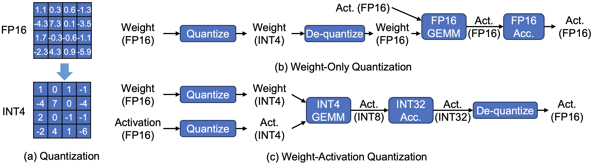
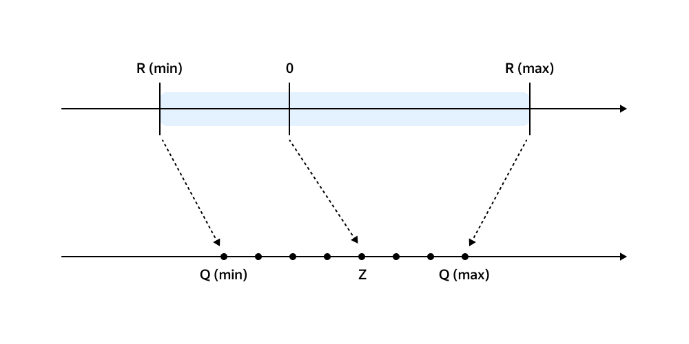
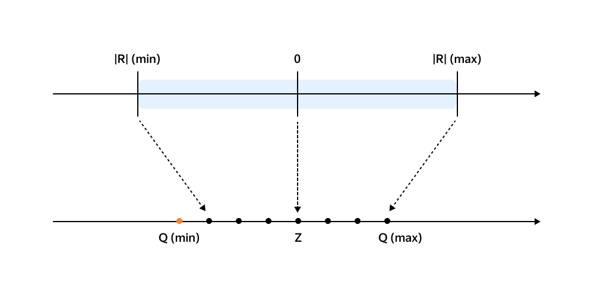
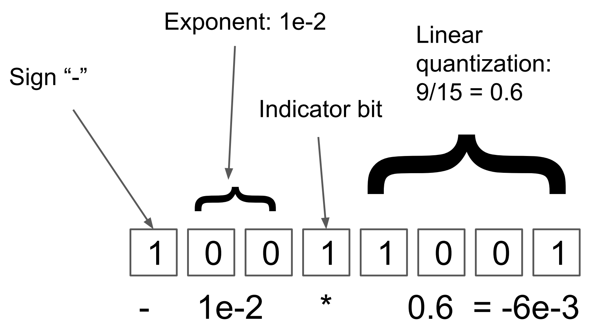
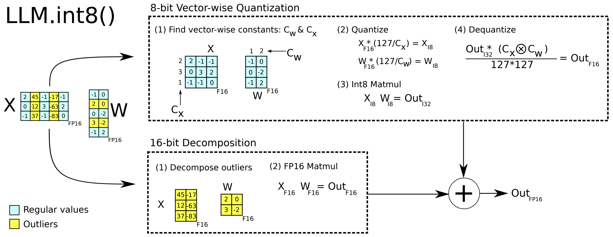
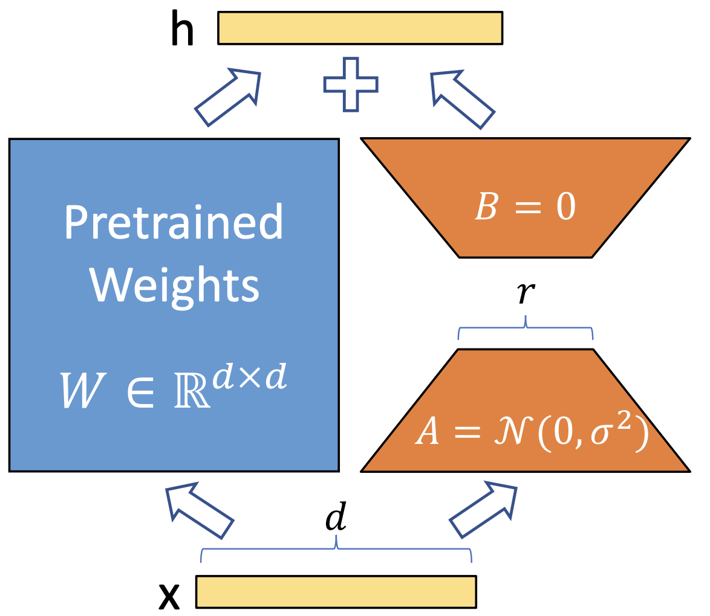
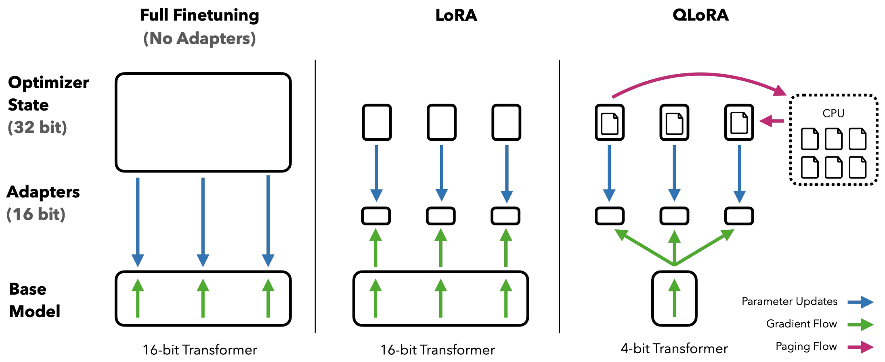
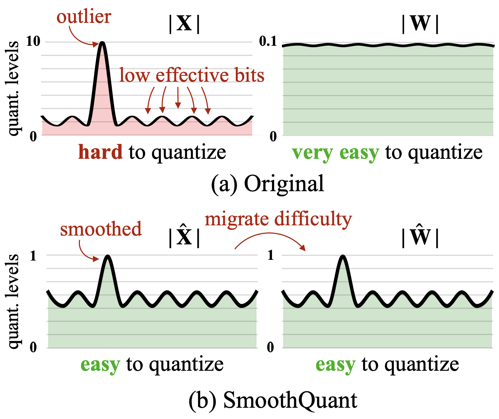
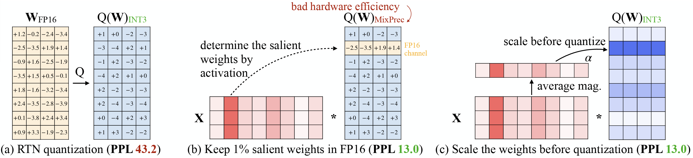

Transformer-based LLMs have revolutionized AI, but deploying them is expensive on two fronts: parameter counts of 10–1000B with context lengths of 128K–1M demand enormous memory capacity, and autoregressive decoding emits one token at a time while re-reading the model weights, which strains memory bandwidth. Quantization attacks both at once, by reducing the number of bits each value takes. This post covers what to quantize, when to quantize, and the methods used in practice.

Quantization reduces the precision of the numbers used to represent neural network parameters (and sometimes activations), for example using 8-bit or 4-bit integers instead of 16-bit or 32-bit floats. By quantizing model weights, LLMs can fit into the device with limited memory capacity. Meanwhile, quantization can significantly shrink its memory footprint and even speed up computation, since more of the model can fit in fast on-chip memory and integer math can be faster on some hardware. 

<!-- Recent advances show it’s possible to compress even 175-billion-parameter models down to 3–4 bits per weight with minimal loss in accuracy – a 2–4× speedup in GPT-class model inference has been reported when using high-end GPUs with quantized weights. -->

## What to quantize? 

**weight-only quantization** quantizes the model’s learned parameters but still computes with high-precision activations. These approaches directly reduces model size and memory load. Other approaches also quantize activations (and even the *KV cache* in LLM decoders), achieving further gains by cutting memory and arithmetic for intermediate values at the cost of potential accuracy degragation.

<figure>
  
  <figcaption style="color: gray; text-align: center;">Figure 1: Weight-only and Weight-Activation Quantization. Figure source: <a href="https://arxiv.org/abs/2410.04466" target="_blank" rel="noopener">https://arxiv.org/abs/2410.04466</a></figcaption>
</figure>

## When to quantize? 

There are two approaches: **quantization-aware training (QAT)**, where the model is trained (or fine-tuned) with quantization in mind, versus **post-training quantization (PTQ)**, where we take a pre-trained model and quantize it in one go. QAT tends to produce the best results, since the model can adjust to low precision during training. PTQ is cheaper due to the one-time quantization nature.

## How to quantize?

Quantization can be catergorized as *Uniform* and *Non-uniform* approaches. Uniform quantization divides the entire range of values into equally sized intervals, which is simple but can lead to information loss when values are unevenly distributed. In contrast, non-uniform method divides the entire range of value into varying-sized intervals based on the value distribution. The uniform quantization further includes Symmetric and Asymmetric variants, with figure and formula shown as follows. 

<figure>
  

    
    
  

  <figcaption style="color: gray; text-align: center;">Figure 2: Asymatric and Symatric Quantization. Figure source: <a href="https://huggingface.co/blog/Isayoften/optimization-rush" target="_blank" rel="noopener">https://huggingface.co/blog/Isayoften/optimization-rush</a></figcaption>
</figure>

The quantization range is determined by the maximum absolute value of the data. The quantization process involves the scaling (S) and shifting (Z) stages. The scaling factor is determined by the range of both source and target ranges. Symmetric quantization skips shifting. The de-quantization process is implemented by reverse shifting and scaling.

**Asymmetric**

- $ S = \frac{r_{\text{max}} - r_{\text{min}}}{q_{\text{max}} - q_{\text{min}}} $
- $ Z = \left[ q_{\text{min}} - \frac{r_{\text{min}}}{S} \right] $
- $ X_{\text{quantized}} = \left[ \frac{X}{S} + Z \right] $
- $ X_{\text{dequantized}} = S \left( X_{\text{quantized}} - Z \right) $

---

**Symmetric**

- $ S = \frac{|r|_{\text{max}}}{2^{N-1} - 1} $
- $ Z = 0 $
- $ X_{\text{quantized}} = \left[ \frac{X}{S} \right] $
- $ X_{\text{dequantized}} = S X_{\text{quantized}} $

Non-uniform quantization is more flexible, borrowing the idea of floating point number. Dynamic tree quantization (DTQ) is a non-linear 8-bit quantization scheme designed to keep errors low for both very small and very large magnitudes. Instead of a fixed split between “exponent” and “fraction” bits, DTQ allows for adjustable split: (1) The first bit of the data type is reserved for a sign. (2) The number of subsequent zero bits indicates the magnitude of the exponent. (3) The first bit that is set to one indicates that all following values are reserved for (4) linear quantization.

<figure>
  
  <figcaption style="color: gray; text-align: center;">Figure 3: Dynamic Tree Quantization. Figure source: <a href="https://ar5iv.labs.arxiv.org/html/2110.02861" target="_blank" rel="noopener">https://ar5iv.labs.arxiv.org/html/2110.02861</a></figcaption>
</figure>

Outliers affect quantization accuracy. Tensors may have 0.01-0.1% of values with very large absolute values. Calculating the scaling factor with these outliers reduces the precision of the remaining values with small absolute. Below we introduces a few advanced approaches to address the outlier issue. 

**LLM.int8** keeps “outlier” activation channels and the corresponding weights in 16-bit to enable 8-bit inference with negligible loss. 

<figure>
  
  <figcaption style="color: gray; text-align: center;">Figure 4: LLM.int8 Quantization. Figure source: <a href="https://arxiv.org/abs/2208.07339" target="_blank" rel="noopener">https://arxiv.org/abs/2208.07339</a></figcaption>
</figure>

**QLoRA** is a 4-bit quantization technique combined with low-rank adaptation (LoRA) for fine-tuning. During parameter efficient fine-tuning (PEFT), the forward pass goes through both the pretrained weights and a low-rank adaptor, while the backward pass is only applied on the low-rank adaptor. The trained adaptor is updated to the pretrained weights, therefore significantly reducing the trainable parameters. In QLoRA, the base model is quantized into 4-bit and loses accuracy, but the 16-bit LoRA fine-tuning process can compensate for the accuracy degradation during quantization.

<figure>
  

    
    
  

  <figcaption style="color: gray; text-align: center;">Figure 5: LoRA and QLoRA. Figure source:  <a href="https://arxiv.org/abs/2106.09685" target="_blank" rel="noopener">https://arxiv.org/abs/2106.09685</a> and <a href="https://arxiv.org/abs/2305.14314" target="_blank" rel="noopener">https://arxiv.org/abs/2305.14314</a></figcaption>
</figure>

Other notable methods include **SmoothQuant** (which smooths out activation magnitude differences between layers to improve 8-bit activation quantization), 

**SmoothQuant** is an 8-bit weight, 8-bit activation (W8A8) post training quantization (PTQ) for LLMs. Based on the fact that weights are easy to quantize while activations are not, SmoothQuant smooths the activation outliers by offline migrating the quantization difficulty from activations to weights with a mathematically equivalent transformation, as shown in the formula and figures as follows.

$$
\mathbf{Y} = \left( \mathbf{X} \, \mathrm{diag}(\mathbf{s})^{-1} \right) \cdot \left( \mathrm{diag}(\mathbf{s}) \, \mathbf{W} \right) = \hat{\mathbf{X}} \, \hat{\mathbf{W}}
$$

<figure>
  
  <figcaption style="color: gray; text-align: center;">Figure 6: SmoothQuant Quantization. Figure source: <a href="https://arxiv.org/abs/2211.10438" target="_blank" rel="noopener">https://arxiv.org/abs/2211.10438</a> </figcaption>
</figure>

**AWQ (Activation-Aware Weight Quantization)** identifies a small fraction (\~1%) of “salient” weights that have outsized impact on activations and keeps those in higher precision (e.g. FP16), quantizing the rest. But this exerts challenges for mixed-precision execution on hardware. Instead of keeping in higher precision, AWQ’s hardware-friendly design multiplies these salient weights with a scaling factor (s>1) before quantization, reducing the accuracy degradation on which, as shown in the formula and figures as follows. 

$$
Q(\mathbf{w}) = \Delta \cdot \mathrm{Round}\left( \frac{\mathbf{w}}{\Delta} \right), 
\quad \Delta = \frac{\max(|\mathbf{w}|)}{2^{N-1}}
$$

where $N$ is the number of quantization bits, and $\Delta$ is the quantization scaler determined by the absolute maximum value. Now consider a weight element $w \in \mathbf{w}$, if we multiply $w$ with $s > 1$ and inversely scale $x$, we will have $Q(w \cdot s)(x/s)$, which is:  

$$
Q(w \cdot s) \cdot \frac{x}{s} 
= \Delta' \cdot \mathrm{Round}\left( \frac{w s}{\Delta'} \right) \cdot x \cdot \frac{1}{s}
$$

where $\Delta'$ is the new quantization scaler after applying $s$.

<figure>
  
  <figcaption style="color: gray; text-align: center;">Figure 7: Activation-aware Weight Quantization. Figure source: <a href="https://arxiv.org/abs/2306.00978" target="_blank" rel="noopener">https://arxiv.org/abs/2306.00978</a></figcaption>
</figure>
